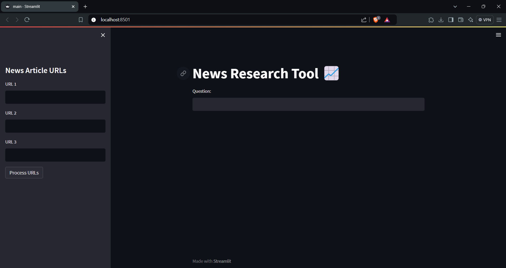

# RockyBot: News Research Tool 📈

RockyBot is a News Research Tool built using Streamlit and Hugging Face APIs. It allows users to input URLs of news articles and ask questions related to the content, retrieving answers and sources from the provided URLs. The app uses FAISS for efficient retrieval of document embeddings.

## Features
- Input up to 3 news article URLs.
- Process and extract content from the URLs.
- Ask questions related to the news content.
- Displays answers and sources in a user-friendly interface.

## User Interface
Below is a screenshot of the current UI:



## Technologies Used
- **Streamlit**: For creating a web interface.
- **LangChain**: Used for managing question-answering workflows.
- **Hugging Face**: Provides the underlying language model and document embeddings.
- **FAISS**: For efficient similarity search in document embeddings.

## Installation

To run this project locally, follow these steps:

1. Clone this repository:
   ```bash
   git clone https://github.com/yourusername/rockybot.git
